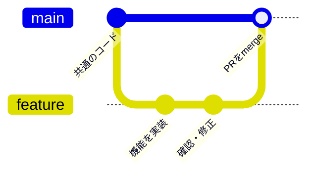
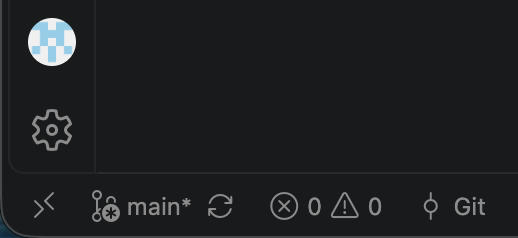
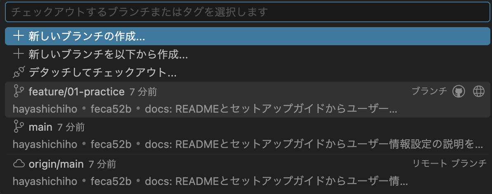

# Quest 2: 作業ブランチを作り、名前を付ける

## 学ぶこと

ブランチは、変更の履歴を分けるための作業場所です。チーム開発では、`main` から機能ごとの作業ブランチを作り、実装後にPRでレビューを受けてからmainへ統合します。作業をブランチごとに分けることで、複数人が並行して開発しやすくなります。

### ブランチ名

この練習では `<種類>/<Issue番号>-<短い説明>` の形式にします。たとえば、Issue #3でタスク追加フォームを作る場合は `feature/3-add-task-form` です。

下記は、よく使うブランチの種類の例です。

| 種類 | 用途 |
| --- | --- |
| `feature/` | 新機能の追加 |
| `fix/` | 不具合の修正 |
| `hotfix/` | 本番環境の緊急修正 |
| `refactor/` | 動作を変えずにコードの構造を改善 |
| `docs/` | ドキュメントの変更 |
| `style/` | 動作を変えない書式・整形の変更 |
| `chore/` | 環境設定などの保守作業 |
| `practice/` | この教材でのGit操作の練習 |

## やること: VS Codeで作成・切り替えする

1. cloneしたプロジェクトをVS Codeで開く。未commitの変更がある場合は、ブランチを切り替える前に内容を確認してcommitする。
2. 左下のブランチ名をクリックする。（画像ではmain）

3. **「新しいブランチの作成…」** を選ぶ。

4. ブランチ名として `practice/2-branch-basics` と入力する。作成後、左下に新しいブランチ名が表示されることを確認する。
5. 左下のブランチ名をクリックして **main** に戻り、同じ操作で作成した練習ブランチへ再び切り替える。

ブランチを作った直後は、mainとファイルの内容は同じです。また、作成したブランチはまだPC上にしかありません。

## 完了条件

- VS Codeで練習ブランチの作成と切り替えができる
- ブランチを分ける理由と名前の意味を、このIssueにコメントする
- **Close issue** でこのIssueを閉じる（変更・commit・PRはまだ不要）

操作の参考: [VS Code公式ドキュメント](https://code.visualstudio.com/docs/sourcecontrol/branches-worktrees)
