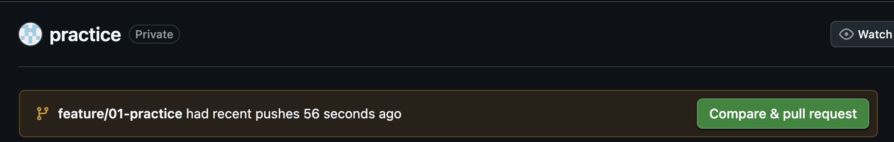
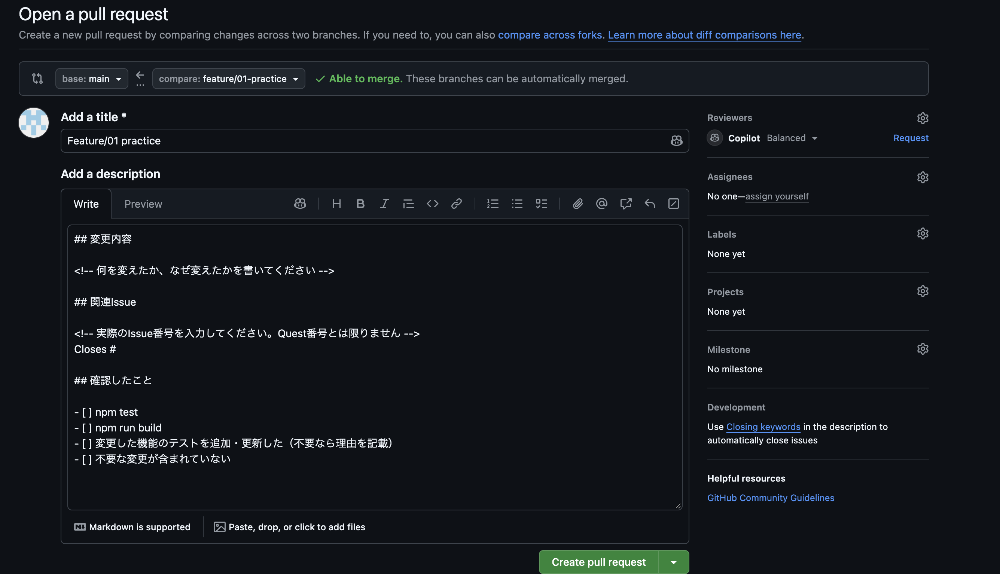
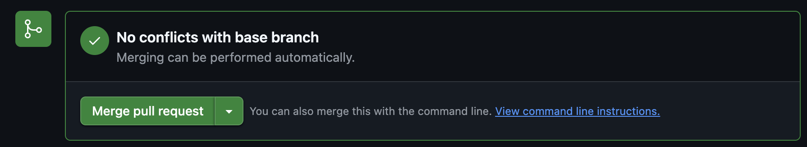

# Quest 3: タスクを追加できるフォームを作る

## やること

`src/App.tsx` にタスク名の入力欄と「追加」ボタンを作り、追加したタスクを一覧の末尾に表示してください。

## 完了条件

- 入力したタスクが追加され、追加後に入力欄が空になる
- 空文字や空白だけでは追加されない
- 追加処理のテストがあり、`npm test` と `npm run build` が通る
- PRをmergeし、このIssueがClosedになっている

## 手順

画像内のリポジトリ名やブランチ名は、自分のものに読み替えてください。

1. Quest 2を参考に、VS Codeの左下のブランチ名からmainへ切り替える。その上で、ターミナルで次を実行してmainを更新する。

```bash
git pull origin main
```

2. VS Codeの左下のブランチ名をクリックし、**「新しいブランチの作成…」** から `feature/3-add-task-form` を作成する。左下に作成したブランチ名が表示されることを確認する。

3. `src/App.tsx` にフォームを実装し、`tests/App.test.tsx` に追加処理のテストを書く。タスクが追加されること、追加後に入力欄が空になること、空白だけでは追加されないことを確認する。
4. `npm test` と `npm run build` が通ったら、差分を確認してcommit・pushする。

```bash
git add src/App.tsx tests/App.test.tsx
git commit -m "feat: add task form"
git push -u origin feature/3-add-task-form
```

5. GitHubで自分のForkを開き、**Compare & pull request** を押す。表示されない場合は **Pull requests → New pull request** を選ぶ。



6. PRの送り先（base）が**自分のForkのmain**、compareが作業ブランチであることを確認する。タイトルに「タスク追加フォームを実装」など変更内容を書き、本文のテンプレートを埋めて **Create pull request** を押す。



本文の記入例です。`Closes #3` は、merge時に指定したIssueを閉じる指定です。

```md
## 変更内容
タスク追加フォームを実装しました。

## 確認したこと
- [x] npm test
- [x] npm run build

Closes #3
```

7. **Files changed** で差分を確認する。修正があれば同じブランチへcommit・pushし、PRを更新する。
8. 確認が終わったら **Merge pull request → Confirm merge** でmergeする。今回は1人での練習なので自分で行う。チーム開発では、通常は他の人にレビューしてもらう。



9. IssueがClosedになったことを確認し、VS Codeでmainへ切り替える。その上で、次を実行してmergeした変更を取り込む。

```bash
git pull origin main
```

<!-- github-practice:quest:01-add-task.md -->
